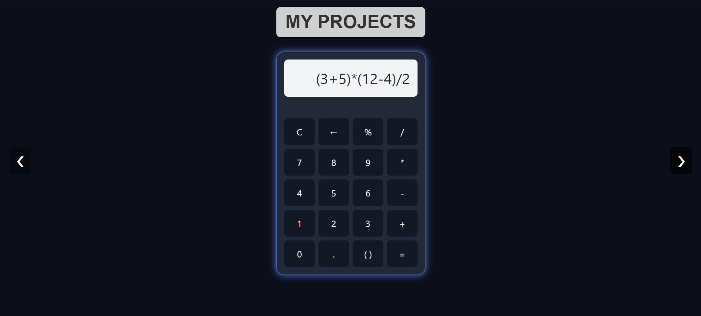

# 🚀 Project Portfolio - Responsive Image Slider

A full-screen, responsive image slider to showcase your development projects like a pro — built using **HTML**, **CSS**, and **JavaScript**.

---

🔗 **Live Demo**: [Click here](https://image-slider-in3sec.netlify.app/)

🔗 **GITHUB LINK** : [Click here](https://github.com/Himanshu-1903/Image-Slider)

---

## ✅ Features

- 🔁 Auto-sliding images (every 3 seconds)
- ⬅️➡️ Manual navigation with left/right buttons
- 🌐 Fully responsive design (mobile + desktop)
- 🖼️ Fullscreen image display with `object-fit: cover`
- ⚡ Lightweight – no libraries used

---

## 🧱 Tech Stack

- HTML5  
- CSS3 (Flexbox, media queries)  
- JavaScript (Vanilla)

---

## 📸 Preview

 <!-- Replace with actual path -->